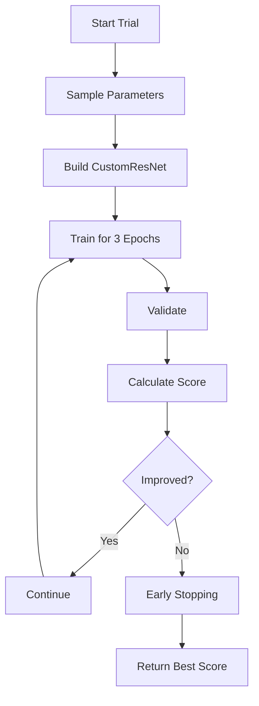

# Multi-Objective Neural Architecture Search with Pareto Frontier Analysis

## Overview
This framework performs neural architecture search with multi-objective optimization using Optuna, focusing on three key metrics: precision, recall, and class distribution bias. The system explores different weight combinations for these objectives and identifies Pareto-optimal solutions.

## Table of Contents
1. [Dataset Preparation](#dataset)
2. [Model Architecture](#architecture)
3. [Mathematical Formulation](#math)
4. [Hyperparameter Optimization](#optimization)
5. [Metrics Calculation](#metrics)
6. [Pareto Frontier Analysis](#pareto)
7. [Usage Instructions](#usage)
8. [Results Interpretation](#results)

## Dataset Preparation
- **Directory Structure**:
```bash
2/
├── Training/
│   ├── class0/
│   │   ├── image001.jpg
│   │   ├── image002.jpg
│   │   └── ...
│   └── class1/
│       ├── image101.jpg
│       ├── image102.jpg
│       └── ...
└── Testing/
    ├── class0/
    │   ├── test001.jpg
    │   └── ...
    └── class1/
        ├── test101.jpg
        └── ...
```

- **Transforms**:
```python
transforms.Resize((128, 128))
transforms.ToTensor()
```

- **Data Loading**:
  - 80-20 train-validation split
  - Batch size: 16
  - Automatic CUDA acceleration

## Model Architecture: Custom ResNet
```python
class CustomResNet(nn.Module):
    def __init__(self, n_layers, width, dropout_rate, num_classes):
        # Initial convolutional block
        Conv2d(3 → width//4)
        BatchNorm + ReLU
        MaxPool(2,2)
        
        # Residual blocks
        for _ in range(n_layers):
            Conv2d(width → width)
            BatchNorm + ReLU
            MaxPool every 2 layers
            Dropout2d(p=dropout_rate)
        
        # Final layers
        AdaptiveAvgPool2d(1,1)
        Linear(width → num_classes)
```

## Mathematical Formulation:
- **Objective Function:**
The optimization target combines three metrics with configurable weights:

$$
\text{Score} = w_1 \cdot P + w_2 \cdot R - w_3 \cdot B
$$

Where:
- **P** = Macro-averaged Precision
- **R** = Macro-averaged Recall
- **B** = Class Bias (Normalized standard deviation of class counts)
- Constraint: $w_1 + w_2 + w_3 = 1$

- **Weight Configuration Space:**
Two resolution grids are available:

  - 25% Step Grid:
    ```python
    [0.0, 0.25, 0.5, 0.75, 1.0]
  - 20% Step Grid:
    ```python
    [0.0, 0.2, 0.4, 0.6, 0.8, 1.0]

All valid combinations where sum is 1 are considered.

- **Hyperparameter Search Space:**

| Parameter      | Range      | Type    | Description                          |
|---------------|------------|---------|--------------------------------------|
| `n_layers`    | [2, 6]     | Integer | Number of convolutional blocks       |
| `width`       | [32, 128]  | Integer | Number of channels in conv layers    |
| `dropout_rate`| [0.0, 0.3] | Float   | Dropout probability                  |

- **Implementation Details:**
```python
# Sampling example in Optuna
n_layers = trial.suggest_int('n_layers', 2, 6)
width = trial.suggest_int('width', 32, 128)
dropout_rate = trial.suggest_float('dropout_rate', 0.0, 0.3)

# Weight combination sampling
weight_str = trial.suggest_categorical('weights', [
    "1.00_0.00_0.00",  # Format: w1_w2_w3
    "0.75_0.25_0.00",
    # ... all valid combinations
])
```

## Optimization process:

