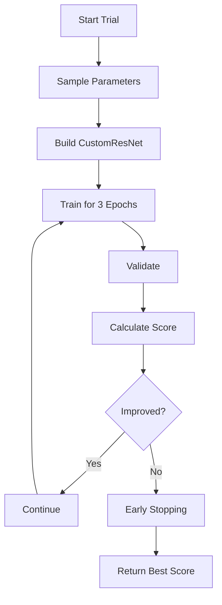

# Multi-Objective Neural Architecture Search with Pareto Frontier Analysis

## Overview
This framework performs neural architecture search with multi-objective optimization using Optuna, focusing on three key metrics: precision, recall, and class distribution bias. The system explores different weight combinations for these objectives and identifies Pareto-optimal solutions.

## Table of Contents
1. [Dataset Preparation](#dataset-preparation)
2. [Model Architecture](#model-architecture)
3. [Mathematical Formulation](#mathematical-formulation)
4. [Hyperparameter Optimization Process](#hyperparameter-optimization-process)
5. [Metrics Calculation](#metrics-calculation)
6. [Pareto Frontier Analysis](#pareto-frontier-analysis)
7. [Usage Instructions](#usage-instructions)
8. [Results Interpretation](#results-interpretation)

## Dataset Preparation
- **Directory Structure**:
```bash
2/
├── Training/
│   ├── class0/
│   │   ├── image001.jpg
│   │   ├── image002.jpg
│   │   └── ...
│   └── class1/
│       ├── image101.jpg
│       ├── image102.jpg
│       └── ...
└── Testing/
    ├── class0/
    │   ├── test001.jpg
    │   └── ...
    └── class1/
        ├── test101.jpg
        └── ...
```

- **Transforms**:
```python
transforms.Resize((128, 128))
transforms.ToTensor()
```

- **Data Loading**:
  - 80-20 train-validation split
  - Batch size: 16
  - Automatic CUDA acceleration

## Model Architecture:
```python
class CustomResNet(nn.Module):
    def __init__(self, n_layers, width, dropout_rate, num_classes):
        # Initial convolutional block
        Conv2d(3 → width//4)
        BatchNorm + ReLU
        MaxPool(2,2)
        
        # Residual blocks
        for _ in range(n_layers):
            Conv2d(width → width)
            BatchNorm + ReLU
            MaxPool every 2 layers
            Dropout2d(p=dropout_rate)
        
        # Final layers
        AdaptiveAvgPool2d(1,1)
        Linear(width → num_classes)
```

## Mathematical Formulation:
- **Objective Function:**
The optimization target combines three metrics with configurable weights:

$$
\text{Score} = w_1 \cdot P + w_2 \cdot R - w_3 \cdot B
$$

Where:
- **P** = Macro-averaged Precision
- **R** = Macro-averaged Recall
- **B** = Class Bias (Normalized standard deviation of class counts)
- Constraint: $w_1 + w_2 + w_3 = 1$

- **Weight Configuration Space:**
Two resolution grids are available:

  - 25% Step Grid:
    ```python
    [0.0, 0.25, 0.5, 0.75, 1.0]
  - 20% Step Grid:
    ```python
    [0.0, 0.2, 0.4, 0.6, 0.8, 1.0]

All valid combinations where sum is 1 are considered.

- **Hyperparameter Search Space:**

| Parameter      | Range      | Type    | Description                          |
|---------------|------------|---------|--------------------------------------|
| `n_layers`    | [2, 6]     | Integer | Number of convolutional blocks       |
| `width`       | [32, 128]  | Integer | Number of channels in conv layers    |
| `dropout_rate`| [0.0, 0.3] | Float   | Dropout probability                  |

- **Implementation Details:**
```python
# Sampling example in Optuna
n_layers = trial.suggest_int('n_layers', 2, 6)
width = trial.suggest_int('width', 32, 128)
dropout_rate = trial.suggest_float('dropout_rate', 0.0, 0.3)

# Weight combination sampling
weight_str = trial.suggest_categorical('weights', [
    "1.00_0.00_0.00",  # Format: w1_w2_w3
    "0.75_0.25_0.00",
    # ... all valid combinations
])
```

## Hyperparameter Optimization Process:


## Metrics Calculation:
- **Precision and Recall:**
`P = TP / (TP + FP)`

$$
R = \frac{TP}{TP + FN} \quad \text{(Recall)}
$$

  - Calculated per-class then averaged (macro-avg)
  - Handles class imbalance by weighting all classes equally
  - $TP$ = True Positives, $FP$ = False Positives, $FN$ = False Negatives

- **Class Bias Metric:**

`B = σ(class_counts) / (μ(class_counts) + ε)`

Where:
- $\sigma$ = standard deviation of class sample counts
- $\mu$ = mean of class sample counts
- $\epsilon = 10^{-6}$ (small constant for numerical stability)

- **Interpretation:**
| Bias Value | Interpretation |
|------------|----------------|
| $B \approx 0$ | Perfectly balanced classes |
| $B > 0.5$ | Significant imbalance |
| $B > 1.0$ | Extreme imbalance |

- **Implementation Code:**

```python
from sklearn.metrics import precision_score, recall_score
import numpy as np

def calculate_metrics(y_true, y_pred, num_classes):
    # Macro-averaged precision/recall
    precision = precision_score(y_true, y_pred, average='macro', zero_division=0)
    recall = recall_score(y_true, y_pred, average='macro', zero_division=0)
    
    # Class bias calculation
    cm = confusion_matrix(y_true, y_pred, labels=range(num_classes))
    class_counts = cm.sum(axis=0)
    bias = np.std(class_counts) / (np.mean(class_counts) + 1e-6)
    
    return precision, recall, bias
```

## Pareto Frontier Analysis:
A solution **x** belongs to the Pareto frontier if:
- **No Dominance**: No other solution is better in all objectives.  
- **Non-Dominated**: For all other solutions **x'**, at least one objective is worse.

$$
\text{x is Pareto optimal if } \nexists\, \text{x'} \text{ such that:}
$$

$$
\begin{cases}
P(\text{x'}) \geq P(\text{x}) \\
R(\text{x'}) \geq R(\text{x}) \\
B(\text{x'}) \leq B(\text{x})
\end{cases}
$$

with **strict inequality** in at least one objective.

## Usage Instructions:
- Virtual environment creation:
```bash
python -m venv mooenv
```
- Activate the virtual environment:
For Windows:
```bash
.\mooenv\Scripts\activate
```
For Linux:
```bash
source mooenv/bin/activate
```

- Dependencies:
```bash
pip install -r requirements.txt
```
- Run the Jupyter notebook (attempt 7) after selecting the mooenv as the kernel.

### Output files:
- full_pareto_results.csv: All completed trials
- full_pareto_front.csv: Pareto-optimal solutions
- Interactive 3D visualization of Pareto frontier

## Results Interpretation:
### CSV Columns:

- **n_layers**: Number of convolutional blocks (2-6)
- **width**: Number of channels in conv layers (32-128)
- **dropout**: Dropout probability (0-0.3)
- **w1/w2/w3**: Objective weights
- **precision/recall**: Macro-averaged metrics
- **bias**: Class distribution imbalance

### Visualization:
- X-axis: Precision
- Y-axis: Recall
- Z-axis: Bias
- Red points: Pareto-optimal solutions
- Gray points: All trials

### Early Stopping Mechanism
- Patience: 2 epochs
- Max Epochs: 3 during search, 5 for final training

### Memory Management
- Automatic CUDA cache clearing after each trial
- Garbage collection enforcement
- Model/optimizer deletion after evaluation

### Customization Points
- Adjust steps_25 and steps_20 for different weight resolutions
- Modify n_layers and width ranges in objective function
- Tune batch size and image resolution
- Adjust early stopping patience

### Conclusion
- This framework enables systematic exploration of the trade-off space between model accuracy metrics and class balance. The Pareto frontier visualization helps identify optimal architectures for different application requirements where precision, recall, and fairness might have varying priorities.
